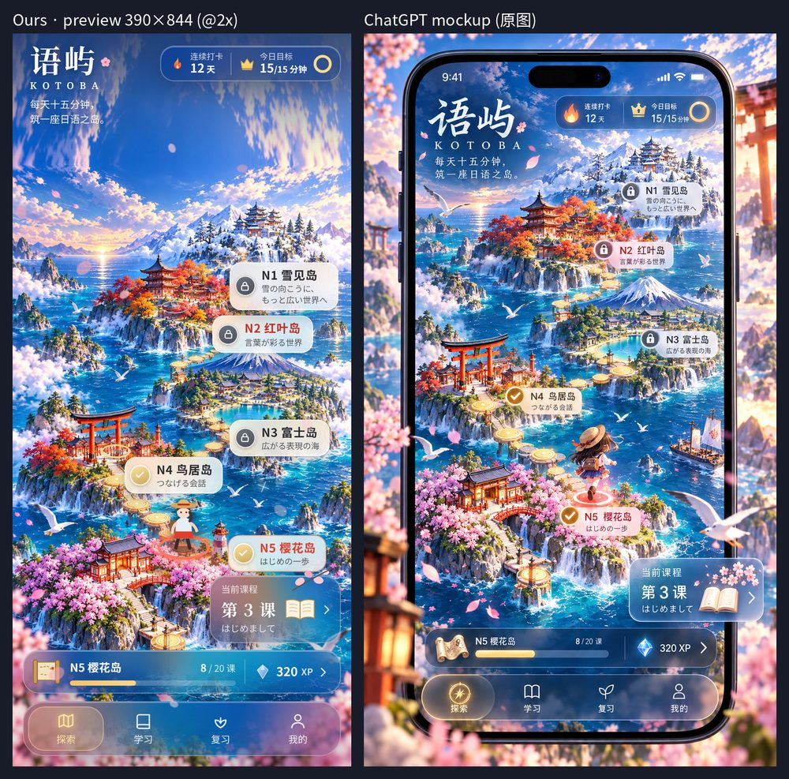

# 探索页「群岛海图」v1.2（N5 → N1）

`#/explore` 换成一张竖向群岛海图：N5 樱花岛在最下，往上依次是 N4 鸟居岛、N3 富士岛、N2 红叶岛、N1 雪见岛。旧版 `renderExplore` 保留在 `app.js` 里，新脚本没加载时自动回退。

（左：390×844 预览；右：设计稿）

## 文件
| 文件 | 说明 |
|---|---|
| `frontend/explore-config.js` | 配置：背景图、岛屿坐标与文案、解锁阈值、每课词数、课程标题、XP、mock 数据 |
| `frontend/explore-map.js` | 页面逻辑：`window.renderExploreMap()` |
| `frontend/explore-map.css` | 样式，类名统一 `xm-` 前缀，不影响旧样式 |
| `frontend/assets/explore/map-bg.webp` / `map-bg.jpg` | 海图底图，941×1672 原尺寸（webp q80 ≈ 443KB，jpg q85 ≈ 547KB），`<picture>` 优先 webp |
| `frontend/assets/explore/map-sky.jpg` | 天空延展图 941×360（≈ 36KB），取底图顶部天空镜像拉伸，屏幕比图高时补满地图上方 |
| `frontend/index.html` | 加 1 个 `<link>`、2 个 `<script>`（**必须在 app.js 之前**：app.js 末尾同步执行 `navigate()`） |
| `frontend/app.js` | `routes['explore'] = window.renderExploreMap \|\| renderExplore;`；`renderStudy()` 开头支持 `StudyCtx.autoStart`（从岛屿直接进背词流）；`APP_VERSION` → 1.2.0 |
| `frontend/sw.js` | `CACHE_NAME` → `yuyu-v22`，预缓存 3 个新 JS/CSS；背景图不预缓存，首次进入探索页时运行时缓存 |

## 布局
- 地图宽 = 屏幕宽，严格保持 941:1672；站点 / 名牌 / 旅人放在同比例容器里，用百分比坐标定位，任何宽度都贴在岛上。
- 图比屏幕矮（如 390×844，图显示为 390×693）时**不滚动**：地图贴底，上方用 `map-sky.jpg` 补满（至少 112px + 安全区给 HUD）。图比屏幕高时才滚动，并自动滚到当前岛。
- `islands[]`：`x / y` 是站点在图上的百分比坐标，`px / py` 是名牌左边缘中点（名牌在岛右侧）。
- 氛围层（`ambience`）：海面闪光、海鸥、薄云，纯 CSS 动画；樱花复用 `startAmbientPetals()`。`prefers-reduced-motion` 时全部关闭。

## 数据来源
| 元素 | 来源 |
|---|---|
| 岛屿状态 | **真实** `/api/books`：N5 默认解锁，上一级 ≥ 80% 解锁下一级，≥ 95% 通关；第一个已解锁未通关的岛为「当前」。同级多本书时优先配置里的 `bookId` |
| 连续打卡 | **真实** `/api/home/summary.streak` |
| 今日目标 | **真实** `today_learned / daily_goal`，单位是「词」（设计稿是「分钟」）；超过 999 显示 999+ |
| 课 / 当前课程 | 后端没有课程模型：每 20 词折成 1 课（`wordsPerLesson`），标题来自 `lessonTitles`，没配的显示词书名 |
| XP | 后端没有 XP，写死 320（`EXPLORE_CONFIG.xp`） |
| mock | `EXPLORE_CONFIG.mock`，`useMockFallback` 默认 `false`（接口失败显示「—」，不展示假数据） |

交互：点已解锁站点 / 名牌 / 课程卡 → 直接进入该级背词流；点锁定站点 → toast + 抖动 + 震动；点底部进度条 → 书架；点 XP → `#/me`。

## 与设计稿的差异
- 「今日目标」单位是词，不是分钟。
- tabbar 用全局的 5 个 tab（含「考试」），只在探索页换成深色玻璃；设计稿是 4 个。
- 1 课 = 20 词；XP 固定 320。
- 旅人是简单的 SVG 小人，不是设计稿里的动漫少女；没有帆船和前景樱花枝 / 灯笼景深。
- 设计稿的地图放大约 1.2 倍并裁掉左右；这里保持「图宽 = 屏宽、不裁切」，岛略小，HUD 下方能看到一段天空。
- 设计稿里 N4 已通关而 N5 在学，真实规则下不会出现。

## 怎么测
1. `docker compose up -d --build`（或 `cd backend && DATA_DIR=../data uvicorn app.main:app --port 8000`），浏览器开 `http://localhost:8000`，登录后点底部「探索」。
2. 用 DevTools 手机模式（390×844）看：不滚动、名牌不压岛、N5 名牌不压课程卡。
3. 点 N5 → 直接进入 N5 背词；点锁定岛 → 提示「尚未解锁」。
4. 已装 PWA 的手机：缓存版本已 bump 到 `yuyu-v22`，重开应用即更新（不行就关掉重开一次）。

底图原始 PNG 和合成脚本未进仓库（体积大 / 已不使用）。
